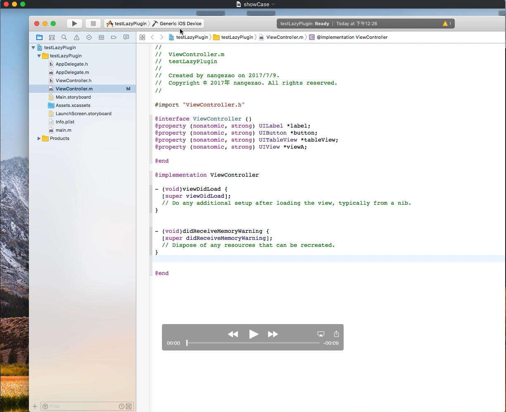

# LazyPlugin
Xcode plugin for generating  lazy getter method

## usage
1. Run LazyPlugin target
2. Run LazyGetter target and select Application (xcode 8 or above) to attatch

###  This project has upgraded to swift4 . Change syntax to swift3 if you want to run with Xcode 8.